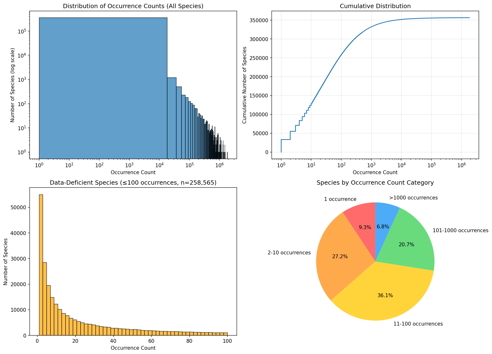

# Data-Deficient Plant Search

The overall goal for this project is to identify candidate locations for collecting samples for a plant species of interest using embeddings from geospatial foundation models and n training samples of GPS locations of that species.

To motivate why this is important, we start by understanding how many GBIF samples we have for every plant species and this distribution. My guess is that we have many samples for a few species, especially in the global north, but most species have very few samples. This web app quantifies this.

## Key Findings

- **356,505** plant species with georeferenced records in GBIF
- **462M** total georeferenced occurrences
- **72.5%** have 100 or fewer occurrences
- **36.5%** have 10 or fewer occurrences
- **9.3%** have just 1 occurrence
- Top species: *Urtica dioica* (Stinging nettle) with **1.8M** occurrences



## Web App

```bash
cd app
npm install
npm run dev
```

Open http://localhost:3000 to explore the data with filtering, sorting, and on-demand species lookups from GBIF.
